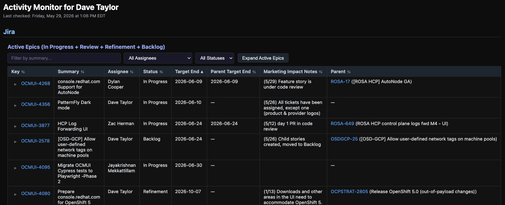
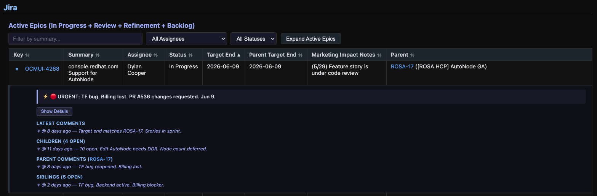
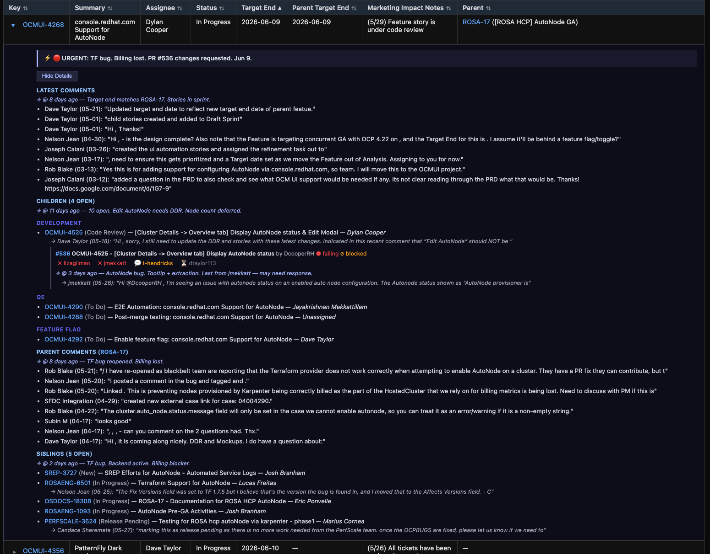
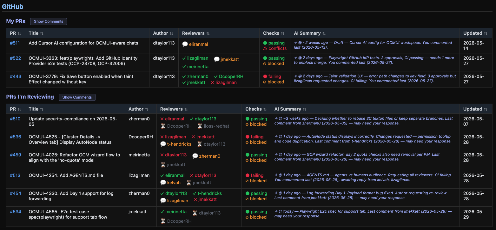
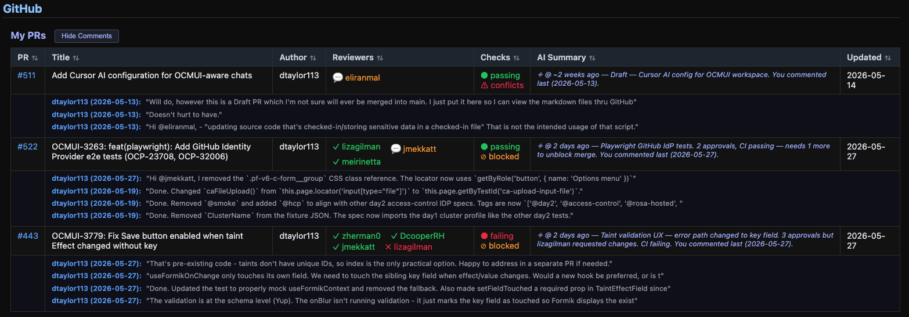

# Activity Monitor

A Cursor AI skill that generates a consolidated status report of your GitHub PR activity and Jira epic progress. It produces an interactive HTML dashboard showing:

- **GitHub PRs** — your open PRs and PRs you're reviewing, with reviewer status, CI checks, merge state, and AI-synthesized summaries
- **Jira Epics** — all your active epics with child stories, parent alignment, sibling epics, target dates, and urgency indicators
- **AI Summaries** — synthesized insights including "ball in court" tracking, age indicators, and cross-section uber summaries per epic

## Screenshots

### Epics Table — Collapsed View
The main table shows all active epics with sortable columns, filters by assignee/status, and color-coded target dates.



### Epics Table — Expanded with AI Summary
Click a row to expand it. The uber AI summary and section-level AI summaries are immediately visible.



### Epics Table — Full Details
Click "Show Details" to reveal raw comments, children grouped by category (Development / QE / Feature Flag), parent comments, and sibling epics with their latest activity.



### GitHub PRs — Collapsed
Split into "My PRs" and "PRs I'm Reviewing" with reviewer status, CI checks, merge state, and AI summaries.



### GitHub PRs — Comments Expanded
Click "Show Comments" to see the most recent unresolved comments per PR.



## Prerequisites

| Requirement | Details |
|-------------|---------|
| `gh` CLI | Authenticated with `repo` and `read:org` scopes |
| Jira API token | Personal API token from Atlassian |
| Cursor IDE | With agent skills enabled |

## Setup

### 1. Clone this repo

```bash
git clone https://github.com/dtaylor113/activity-monitor.git
cd activity-monitor
```

### 2. Create your token file

```bash
cp setup-tokens.example.sh ~/ocmui-tokens.sh
```

Edit `~/ocmui-tokens.sh` and fill in your values:

```bash
export GITHUB_USER="your-github-username"
export GITHUB_REPO="RedHatInsights/uhc-portal"
export JIRA_EMAIL="you@redhat.com"
export JIRA_TOKEN="your-jira-api-token"
export JIRA_INSTANCE="redhat.atlassian.net"
export JIRA_PROJECT="OCMUI"
```

**Where to get tokens:**
- **Jira**: https://id.atlassian.com/manage-profile/security/api-tokens
- **GitHub**: `gh auth login` (preferred) or https://github.com/settings/tokens

### 3. Source it from your shell config

```bash
echo 'source ~/ocmui-tokens.sh' >> ~/.bashrc   # or ~/.zshrc
source ~/.bashrc
```

### 4. Verify your setup

```bash
bash ~/ocmui-tokens.sh   # Run directly to check all vars are set
```

### 5. Install the skill in Cursor

Cursor looks for skills in `~/.cursor/skills/`. Create a symlink:

```bash
mkdir -p ~/.cursor/skills
ln -s "$(pwd)" ~/.cursor/skills/activity-monitor
```

### 6. Authenticate `gh` CLI (if not already)

```bash
gh auth login
```

That's it. No scripts or skill files to edit — all configuration comes from environment variables.

## Usage

Ask your Cursor agent any of:
- "Run the activity monitor"
- "What's new?"
- "Morning briefing"
- "Check my notifications"
- "Status update"

The agent will:
1. Run `scripts/gather.sh` to collect data from GitHub and Jira APIs
2. Assemble the data into `activity-data.js`
3. Generate AI summaries for each section

Then open `ACTIVITY_MONITOR.html` in a browser to view the dashboard.

## Security: How Tokens Stay Safe

Tokens are stored in environment variables, **not** in files the AI can read. This matters because:

```
~/ocmui-tokens.sh          ← Your actual tokens (never read by AI)
    ↓ (sourced by)
~/.bashrc                  ← Loads tokens into shell environment
    ↓ (inherited by)
Cursor shell processes     ← Have access to $JIRA_TOKEN etc.
    ↓ (AI uses)
curl -u "$JIRA_TOKEN"...   ← Token expands locally, not sent to LLM
```

The AI sees `$JIRA_TOKEN` in command text, but the **shell expands it locally** — the actual value never leaves your machine or gets sent to the LLM provider.

**Best practices:**
- Never store tokens in files the AI reads (like `.mdc` rules or skill files)
- Don't ask the AI to run `env` or `printenv` (would expose values)
- Keep `~/ocmui-tokens.sh` **outside** the repo — never commit it
- Rotate tokens periodically

## File Structure

```
activity-monitor/
├── README.md                  # This file
├── SKILL.md                   # Agent instructions (how the AI runs the skill)
├── ACTIVITY_MONITOR.html      # Static HTML template (rarely changes)
├── setup-tokens.example.sh    # Token template — copy outside repo and fill in
├── scripts/
│   └── gather.sh              # Data collection script (GitHub + Jira APIs)
├── activity-data.js           # Generated data (gitignored)
└── .gitignore
```

## How It Works

1. **`gather.sh`** reads config from env vars and calls GitHub + Jira APIs, outputting structured JSON sections
2. The Cursor agent parses that output and assembles `activity-data.js`
3. The agent writes AI summaries by reading comments and synthesizing insights
4. **`ACTIVITY_MONITOR.html`** loads `activity-data.js` and renders everything client-side

The HTML is a self-contained single-page app — no build step, no server, no dependencies.

## Environment Variables Reference

| Variable | Required | Example | Purpose |
|----------|----------|---------|---------|
| `GITHUB_USER` | Yes | `dtaylor113` | Your GitHub username |
| `GITHUB_REPO` | Yes | `RedHatInsights/uhc-portal` | Repo to monitor |
| `JIRA_EMAIL` | Yes | `you@redhat.com` | Jira API authentication |
| `JIRA_TOKEN` | Yes | *(API token)* | Jira API authentication |
| `JIRA_INSTANCE` | Yes | `redhat.atlassian.net` | Jira Cloud hostname |
| `JIRA_PROJECT` | Yes | `OCMUI` | Jira project key |
| `GITHUB_TOKEN` | No | *(PAT)* | Only if not using `gh auth login` |

## Customization

- **Different repo**: Change `GITHUB_REPO` in your tokens file
- **Different Jira project**: Change `JIRA_PROJECT`
- **Comment depth**: gather.sh fetches last 8 unresolved non-bot comments per PR
- **Lookback period**: Default 3 days, configurable via `--since` flag
